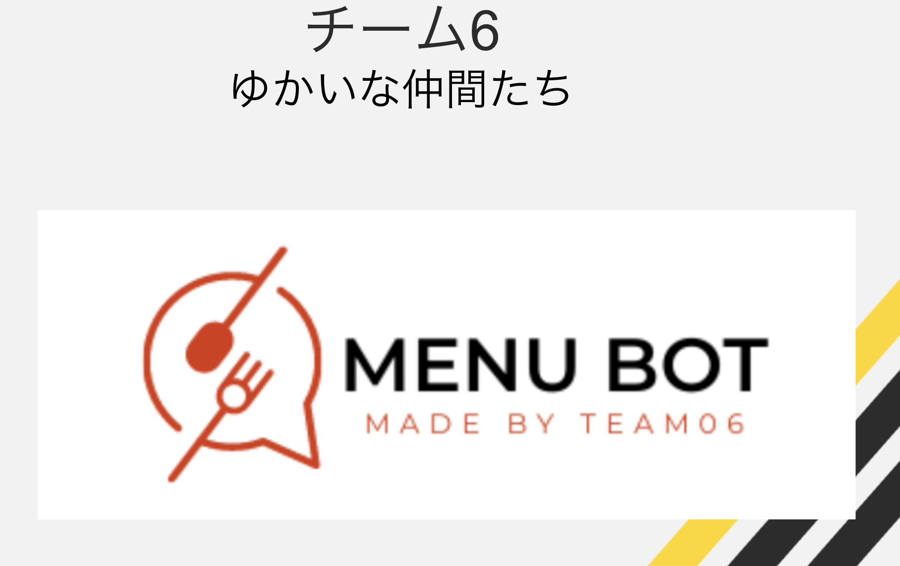
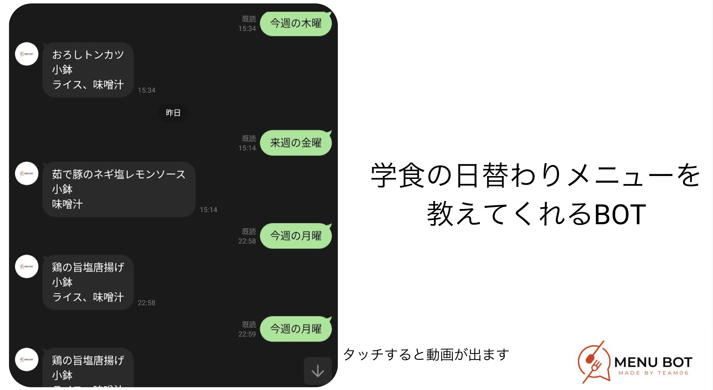
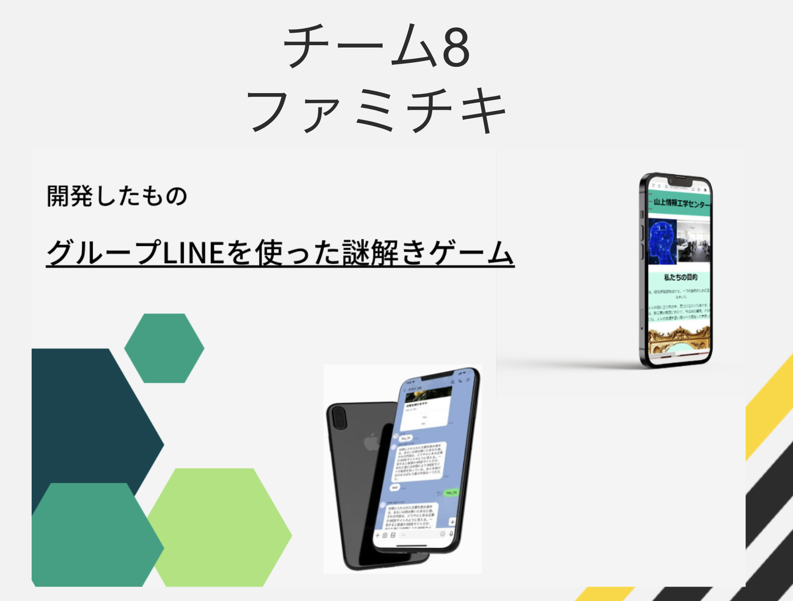
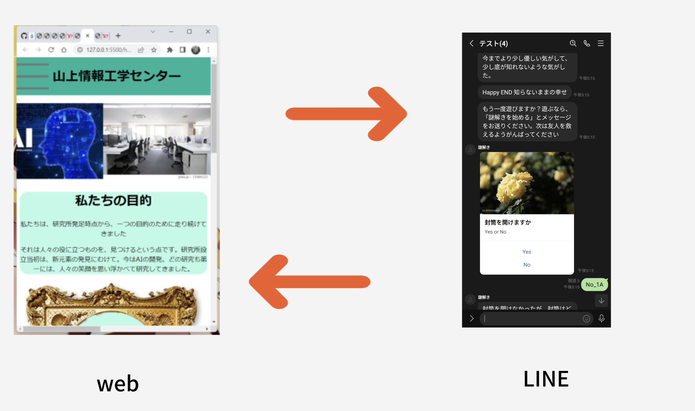
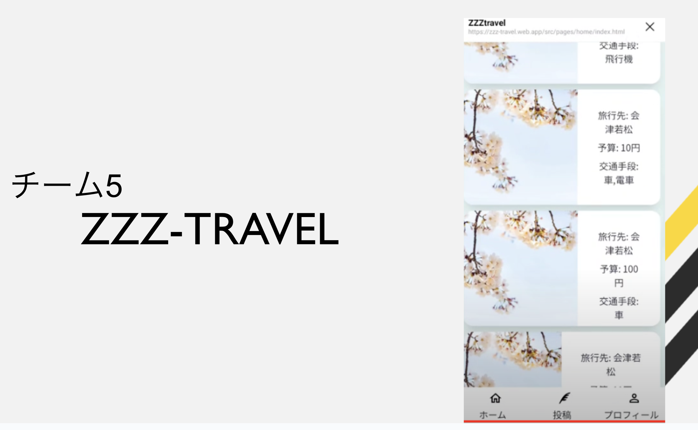
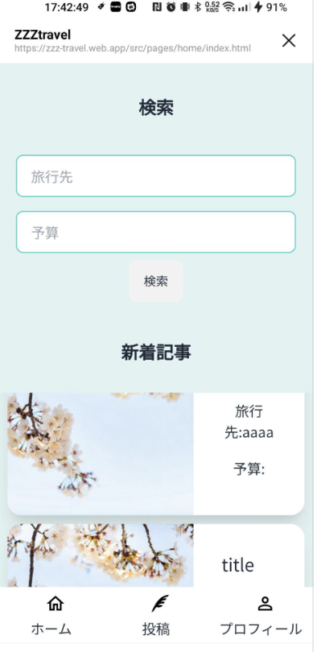
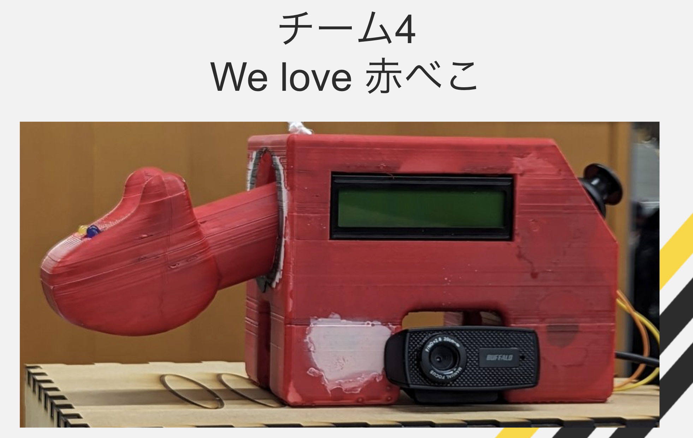
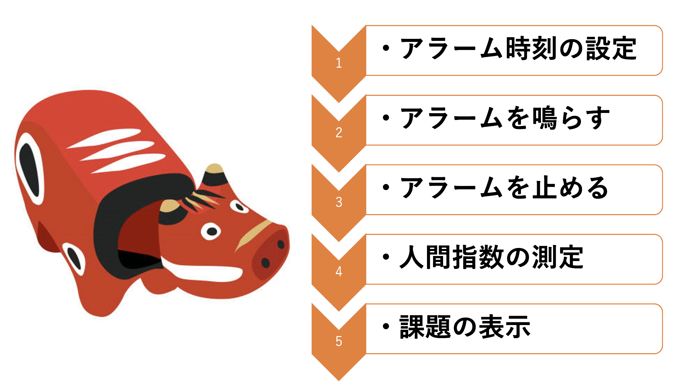

# AizuHack2023 を開催しました！

## AizuHack の概要

AizuHack とは、プログラミング初心者の 1, 2 年生向けに開催する勉強会付きハッカソンです。
勉強会 4 回+各チームメンター付きのハッカソンを 1 ヶ月実施することで 1, 2 年生にプログラミングの楽しさを知ってもらう、関心を高めてもらうことを目的としています。

## コースについて

今回の AizuHack では、以下の 3 コースに分かれて勉強会を行いました。

- LINE Bot コース
- Web フロントエンドコース
- IoT コース

勉強会終了後、各コース修了者を組み合わせた複合チームを作り、ハッカソンを開催します。

## 協賛

- LINE Developer Community

## スケジュール

| 日程               | イベント                          |
| ------------------ | --------------------------------- |
| 4/5(水)            | 募集開始                          |
| 4/26(水)           | 募集終了                          |
| 4/30(日)           | キックオフ                        |
| 5/8(月)~5/14(日)   | 勉強会 1 回                       |
| 5/15(月)~5/21(日)  | 勉強会 2 回                       |
| 5/22(月)~5/28(日)  | 勉強会 3 回                       |
| 6/9(金)~6/11(日)   | 勉強会 4 回                       |
| 6/12(月)~6/16(金)  | 勉強会 EX 回                      |
| 6/17(土), 6/18(日) | アイデアソン&ハッカソンキックオフ |
| 7/16(日)           | 最終発表                          |
| 7/23(日)           | 表彰式                            |

## コース一覧

### LINE Bot コース

- Web コースと合同の JavaScript 勉強会
- LINE Bot を作って動かしてみよう, ソースコードの解説
- LINE Bot Designer, FlexMessage
- リッチメニュー, PUSH メッセージについて, 外部 API との通信, DynamoDB の使い方
- AWS へのデプロイ

### Web コース

- LINE Bot コースと合同の JavaScript 勉強会
- HTML・CSS
- DOM API
- HTTP API
- express でバックエンド

### IoT コース

- C 言語
- マイコンの基礎
- センサ・アクチュエータを使うハンズオン
- マイコンを使用した HTTP 通信
- IoT 機器作成で役立つ他の知識

## 勉強会

勉強会では、各コースの講師とメンターがコースによる技術を教えます。参加者のほとんどが 1, 2 年生で、プログラミング初心者です。
そのため、ついていくのが大変だと感じることもあったかもしれませんが、講師やメンターがサポートしたり、自分で勉強したり、他の参加者と相談しながら進めていったりすることで、最終的には全員がハッカソンに参加できるレベルになりました。

## アイデアソン

ハッカソンの前にアイデアソンを行いました。各コースの参加者が集まり、アイデアを出し合いました。みなさん、とてもいいアイデアを出してくれました。
アイデアクリエーションでは Miro を活用してマインドマップやリーンキャンバス等を使用しました。

## ハッカソン

1 ヶ月間チームメンバーと協力して、アイデアソンで出たアイデアを実現するために、プログラミングを行いました。各自で調べたりメンターに相談するなどしてハッカソン中に新しい技術を習得するチームもいました。最終的には、各チームが素晴らしいもの制作できました。
発表時間は 10 分で、その他も一般的なハッカソンの成果発表と同じような形です。

## 最終発表

1 ヶ月間のハッカソンの成果を発表しました。各チームが素晴らしいものを作っていました。

### 評価基準について

今回のハッカソンでは、メンター全員に以下の項目で評価点をつけて頂きました。
加えて、オーディエンスによる投票も行いました。

#### 共通評価項目

全作品共通の評価項目です。

- 発表資料は見やすかったか？（5 点満点）
- プロダクトの魅力は発表で伝わったか？（5 点満点）
- 以上 2 つは、発表時間超過 1 分あたり素点の 10%減点
- ワクワクする作品か？（10 点満点）
- アイデアの創造性（10 点満点）
- 作品は最低限動作するか？（10 点満点）
- 技術的なレベルは高いか？（10 点満点）

### 個別評価項目

それぞれの技術を使っている作品のみが評価対象となる項目です。

- LINE Bot 技術の活用度・完成度
- Web 技術の活用度・完成度
- IoT 技術の活用度・完成度

## 表彰式

受賞チームにその場で賞品の受け渡しをして受賞チームメンバーから一言ずつコメントを貰いました。
最終的には、以下のチームが表彰されました。

### 最優秀賞

### 学食 API

学食をおしえてくれる LINE Bot を作成していました。

### LINE 賞

### 謎解き

LINE Bot で謎解きゲームを作成していました。

### Web 賞

### ZZZ-travel

観光情報登録サイトを作成していました。

### IoT 賞

#### 高性能赤べこ

高性能赤べこを作成していました。アラーム、画像処理、3D プリントをしていました。

## まとめ

みなさん初めてのハッカソンにも関わらず、完成度の高いものを作成していました。素晴らしい成長です。これからもほかのハッカソンにも参加してどんどん成長してほしいです。みなさんお疲れ様でした。
