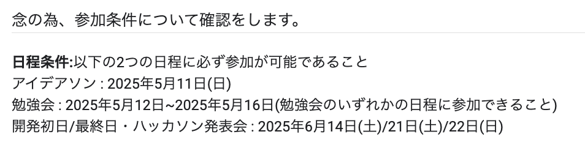
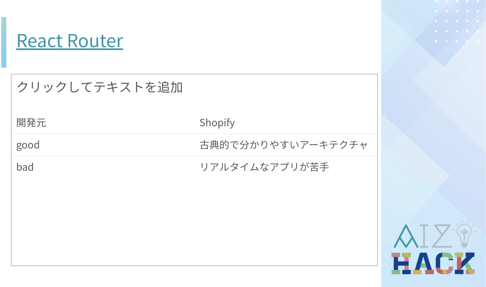
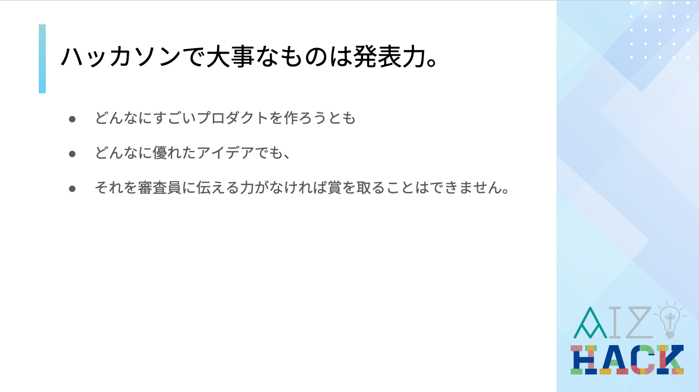
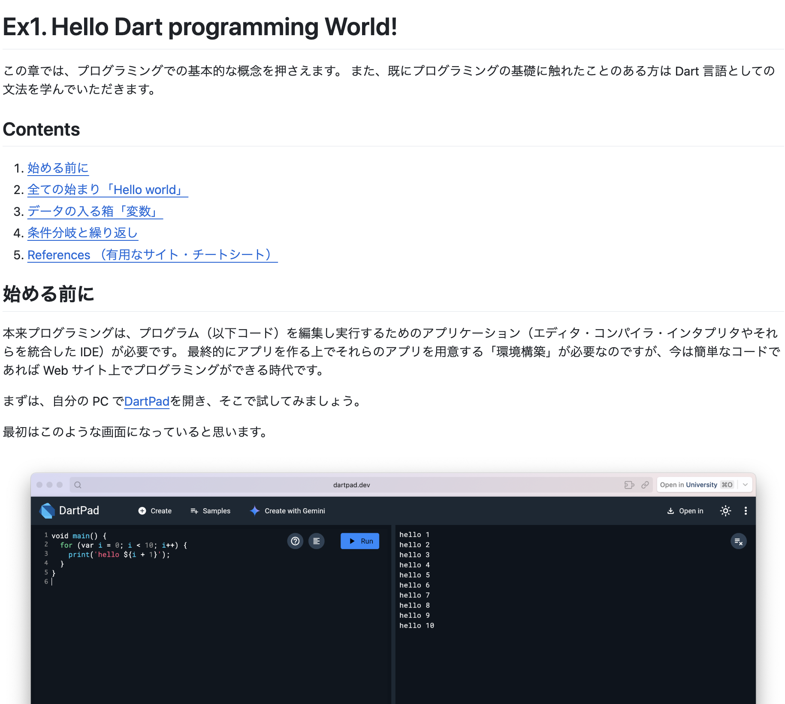

※記事のタイトルでは AizuHack/Re_AizuHack となっていますが、以降は Aizu Hack / Re:Aizu Hack と表記させていただきます。

## はじめに

Zli Blog をご覧の皆様こんにちは！
会津大学学部 2 年、Aizu Hack / Re:Aizu Hack の運営のお手伝いをさせていただいたアト([@Aizu_AizuAizu](https://x.com/Aizu_AizuAizu))と申します。
この度、Aizu Hack / Re:Aizu Hack についての振り返り記事を寄稿させていただく運びとなりました。
拙筆ではございますが、是非ご覧になっていただけると幸いです。

## 協賛

Aizu Hack / Re:Aizu Hack の開催にあたり、ご協賛いただいた企業の皆様に、心より厚く御礼申し上げます。

- 株式会社 J ストリーム 様
- STORES 株式会社 様
- 株式会社いい生活 様

## Aizu Hack / Re:Aizu Hack 開催の経緯

これまで Zli で行われた「AizuHack」では、プログラミング初心者の 1、2 年生を対象に、勉強会とハッカソンを組み合わせたイベントとして開催してきました。
しかし、これまで開催してきた中で、勉強会の途中で離脱してしまう学生が多いという課題に直面していました。（去年は Zli BootCamp という形で勉強会を行なったものの、最終的に 6~7 割の方がモチベーションを保てない等の理由により、離脱してしまう...）

そのため、ただ勉強会+ハッカソンを行うだけでなく、企業様のご支援をいただくことで参加者が技術力を身につけつつ、参加した学生が最後まで意欲的に開発できる環境を整えられるのではないかと考え、新たな形で開催することを決定しました。

また、会津大学には高い技術力を持つ学生が数多く在籍しているにも関わらず、学内でその能力を発揮する機会が限られていたため、AizuHack に上級者向けの枠を新設することで、対外的な成果にも繋げたいと考えました。
以上の理由から、新入生および未経験者向けの枠を Aizu Hack、上級者向けの枠を Re:Aizu Hack として、新たな形での開催が決まりました。

## スケジュール

参加フォームでもご案内した通り、次のような日程にて行われました。

| 日程               | イベント                      |
| ------------------ | ----------------------------- |
| 5/11(日)           | アイデアソン                  |
| 5/12(月)〜5/16(日) | 勉強会期間                    |
| 6/14(土)           | HackDay: KickOff              |
| 6/21(土)           | HackDay: 発表会               |
| 6/22(日)           | HackDay: 結果発表および懇親会 |

## アイデアソン

Aizu Hack / Re:Aizu Hack のアイデアソンでは、発表されたテーマ「変幻自在」に基づき、各々のチームがそれぞれアイデアを出し合い、発表しました。
中には変幻自在な OS の自作を目指すチームもおり、各チーム個性と魅力が溢れた発表でした。

その後、各チームにフィードバックを送り、今後のプロダクト開発の参考にして頂きました。

## 勉強会

アイデアソンの後、AizuHack 参加者向けに 39sho([@G_39sho](https://x.com/G_39sho))がプログラミングの基礎の説明を行いました。

プログラミング基礎資料リンク

https://docs.google.com/presentation/d/136iRuj0gSxJ5fXYNcKed8d9YH1NmM7iDmchpMWLzIF4/

その後、各々のチームが考えたアイデアを実現するために先輩方がメンターを務める勉強会を行いました。

### Web 勉強会

主に ulong32([@ulong32](https://x.com/ulong32))、39sho とゆるり([@yurunull](https://x.com/yurunull))がメンターとなり、Web フロントエンドの技術について学びました。

勉強会資料リンク

https://docs.google.com/presentation/d/1wWEHWzK4x12EyCARP7o0UgS1Xw5dznVOD02CFmOyOIU/

### ハッカソンについての説明・戦い方

外部で開催された複数のハッカソンに参加し、所属したチームでの優勝経験もあるしゃけのきりみ。氏([@shakenokirimi12](https://x.com/shakenokirimi12))によって、ハッカソンの戦い方についての説明が行われました。

### Git 基礎

kashu([@kasukashu02](https://x.com/kasukashu02))と yuorei([@yuorei71](https://x.com/yuorei71))によって、基礎編と応用編に分けて Git の使い方を学びました。

### モバイル

ress([@ress02\_](https://x.com/ress02_))と Plat([@105techno](https://x.com/105techno))によって、Flutter で使われる言語である Dart の勉強と、Flutter の使い方の勉強会を行いました。

勉強会資料リンク

https://github.com/Outtech105k/AizuHack2025MobileTutorial/tree/main?tab=readme-ov-file

### ゲーム制作入門

会津大学公認 XR サークルである[A-PxL](https://sites.google.com/view/a-pxl)と共同で勉強会を行い、ゲーム開発に必要な Unity と Blender の使い方を学びました。

勉強会（A-PxL）資料リンク

https://a-pxl.notion.site/2025_A-PxL-1e2f282be1eb8056bb4dcf82864c6256

### アルゴリズムとデータ構造入門

kotakun([@kotakun2724](https://x.com/kotakun2724))と amesyu([@amesyu2](https://x.com/amesyu2))によって、読みやすく、計算量の少ないコードの書き方について学びました。

勉強会資料リンク

https://www.notion.so/1f2dd07b5e12801a804ddd1742725cc0

## HackDay: キックオフ

アイデアソンから 1 ヶ月間、チームメンバーと協力して、アイデアソンで出たアイデアを実現するために、アイデアの実現に必要な技術の勉強をを行いました。
その後、いよいよ HackDay(開発期間)が始まります。

各チームとも連携しつつ開発をはじめ、開発が行き詰まった際にはメンターに質問を行い解決する場面も見られました。

## HackDay: オンライン交流会

HackDay 期間中、各企業様から今回のハッカソンの開発で役立てるよう、参加者とのオンライン交流会を行いました。

交流会ごとにそれぞれ独自の色が出ており、どの交流会も大変興味深い内容でした。

## HackDay: 発表会

おおよそ１週間にわたる*~限界~*開発の後は、ついに発表です。
1 チーム 7 分という課せられた発表時間の中、Aizu Hack の各チームは初心者ながらも初めて作ったとは思えないような発表の連続で、Re:Aizu Hack の各チームも持ち前の技術力を活かした高いレベルでの発表が行われました。

## 表彰式

受賞されたチームには、以下の賞が贈られました。

- 最優秀賞
- 各企業賞（Jstream 賞、STORES 賞、いい生活賞）
- 審査員特別賞(急遽追加！　企業賞、最優秀賞には惜しくも選ばれなかったものの、審査員の中で評価が高かった作品)

## まとめ

Aizu Hack に参加された方々は初めてのハッカソンにも関わらず、高い完成度のものを作成していました。近年の技術力のインフレが凄すぎる...！。　そして、Re:Aizu Hack に参加された方は持っている技術力をフルに活かし、私たちの想像をはるかに超えたものを見せてくださいました。ご参加いただいた皆様に、心より感謝申し上げます。

しかし、参加者の初心者・上級者枠の割り当て方法やオンライン交流会の形式、運営担当者の変更、それに伴う調整など、多くの反省点が残りました。円滑なイベント運営ができなかった点につきましては、心よりお詫び申し上げます。皆様からいただいたご意見を真摯に受け止め、今後の運営に活かしてまいります。

来年度の開催形式は未定ですが、Zli では今後も技術を学び始めたばかりの方々が安心して楽しく学ぶことができるイベントを開催していきたいと考えています。

今回のイベントで初めて開発を経験された方は、これからも外部のハッカソンやチーム開発にも積極的に参加し、好きな技術をとことん突き詰めていってください！

## 謝辞

今回の Aizu Hack / Re:Aizu Hack における全てのデザイン（ロゴや勉強会スライドのテーマ作成等）を担当してくださったゆるりさん、また、素敵なウェブサイトを作成してくださった ulong32 さん、そして勉強会のメンターを務めてくださった方々にも、重ねて厚くお礼申し上げます。

改めて、最後まで今回のイベントに参加してくださった方々、協賛してくださった各企業様、そしてこのイベントの開催にご協力くださった GDGoC Aizu に、心より感謝申し上げます。

## 各 URL

それぞれの URL はこちらからご覧下さい。

[一昨年の AizuHack の記事](https://blog.zli.works/#/blog/aizuhack-2023)

[Aizu Hack / Re:Aizu Hack connpass](https://zli.connpass.com/event/349133/)

[Aizu Hack / Re:Aizu Hack Website](https://2025.aizuhack.zli.works/)　(made by ulong32)
